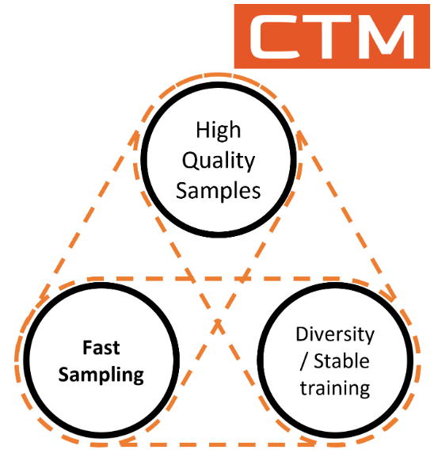

# [ICLR'24] Consistency Trajectory Model (CTM)
<p align="center">

</p>
This repository houses the official PyTorch implementation of the paper titled "Consistency Trajectory Models: Learning Probability Flow ODE Trajectory of Diffusion" on LSUN Bedroom 256x256 dataset.

* [arXiv](https://arxiv.org/abs/2310.02279)
* [Project Page](https://consistencytrajectorymodel.github.io/CTM/) 
* [OpenReview](https://openreview.net/forum?id=ymjI8feDTD)
* [Codes of CIFAR-10](https://github.com/Kim-Dongjun/ctm-cifar10)
* [(NEW!) Jupyter Notebook](https://github.com/ChiehHsinJesseLai/ctm-notebook)

Contacts:
* Dongjun KIM: <a href="dongjun@stanford.edu">dongjun@stanford.edu</a>
* Chieh-Hsin (Jesse) LAI: <a href="chieh-hsin.lai@sony.com">chieh-hsin.lai@sony.com</a>

## TL;DR
For single-step diffusion model sampling, our new model, Consistency Trajectory Model (CTM), achieves SOTA on CIFAR-10 (FID 1.73), ImageNet 64x64 (FID 1.92) and LSUN-Bedroom 256x256 (FID 2.30). CTM offers diverse sampling options and balances computational budget with sample fidelity effectively.

## Result Examples
  

## Evaluation Results
Evaluation has been done on lsun bedroom validation dataset.<br>
Evaluation metrics used are: FID(Frechet Inception Distance), Recall and Precision.

| NFE | FID| Recall| Precision|
|---|---|---|---|
| 1 | 2.30 | 46.78 % | 66.48 %|
| 2 | 1.89 | 51.88 % | 63.33 %|

## Environment Setup
1. Install docker to your own server
    - Use the `build.sh` and `launch.sh` scripts provided in the [docker](./docker) folder to create and launch the Docker container.

## Sampling
1. Download [CTM checkpoint on LSUN-Bedroom256 (ema=0.999)](HF link to released checkpoint) for quick sampling and evaluation.
2. Please refer `commands/sampling_commands.sh` for detailed sampling commands.

## Evaluating
1. Download [LSUN-Bedroom256 reference statistics](https://openaipublic.blob.core.windows.net/diffusion/jul-2021/ref_batches/lsun/bedroom/VIRTUAL_lsun_bedroom256.npz) for computing FID, sFID, IS, precision, recall. Please locate them in `args.ref_path` npz) for computing FID, sFID, IS, precision, recall. Please locate them in `args.ref_path`
2. Generate samples (>=50k samples for correct evaluation):
    - Update below arguments in `commands/sampling_commands.sh` for generating 50k samples:
        - `--eval_num_samples=50000`
        - `--batch_size=50`
3. Run `python evaluations/evaluator.py [location_of_statistics] [location_of_samples]`
    - The first argument is the reference path to `VIRTUAL_lsun_bedroom256.npz` and the second argument is the folder of generated 50k samples.

## Training
1. Download teacher model (Pretrained diffusion model) [edm_bedroom256_ema](https://openaipublic.blob.core.windows.net/consistency/edm_bedroom256_ema.pt) and locate it in `args.teacher_model_path`
2. Dataset preparation:
    - Download the LSUN Bedroom Dataset by following instructions in [fyu/lsun](https://github.com/fyu/lsun) repository
    - Use the [LSUN_Bedroom_Download/read_write_lsun.py](./LSUN_Bedroom_Download/read_write_lsun.py) script to convert images stored in the LMDB database into PNG files and save them to specified directories.

3. Add correct folder paths and parameters in the below command scripts,then perform the training as given below.
    - For CTM+DSM training, run `bash commands/CTM+DSM_command.sh`<br>
        Recommendation: at least run CTM+DSM for 10~50k iterations
    - For CTM+DSM+GAN training, run `bash commands/CTM+DSM+GAN_command.sh`<br>
        Recommendation: at least run CTM+DSM+GAN for >=30k iterations


## Citations
```
@article{kim2023consistency,
  title={Consistency Trajectory Models: Learning Probability Flow ODE Trajectory of Diffusion},
  author={Kim, Dongjun and Lai, Chieh-Hsin and Liao, Wei-Hsiang and Murata, Naoki and Takida, Yuhta and Uesaka, Toshimitsu and He, Yutong and Mitsufuji, Yuki and Ermon, Stefano},
  journal={arXiv preprint arXiv:2310.02279},
  year={2023}
```